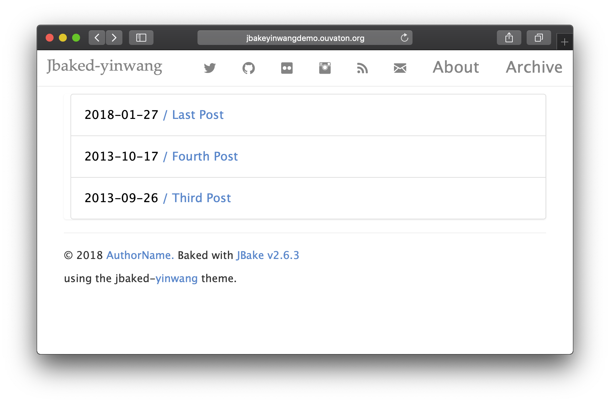
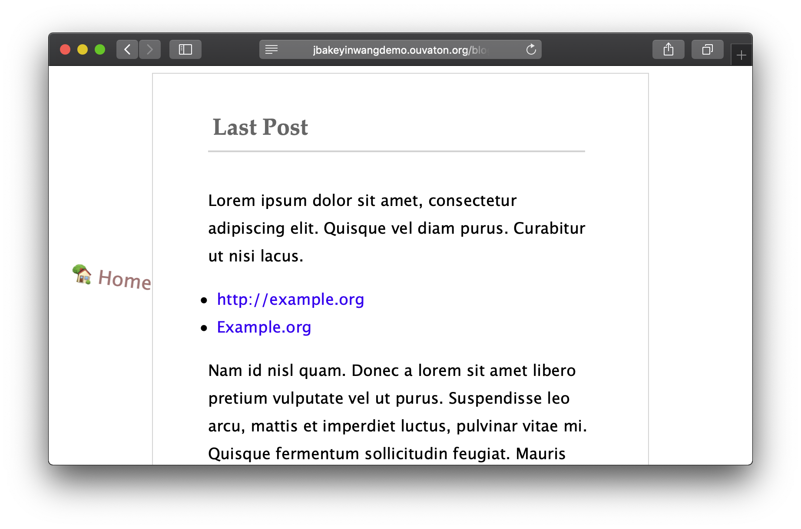

# Jbake-yinwang thème

---

Jbake-yinwang est un thème minimal, pour Jbake il est basé sur [hugo-yinwang](https://github.com/chinanf-boy/gohugo-theme-yinwang) - un thème minimal, pour Hugo.

## Copie d'écran

## Fonctionnalités

- Clair
- Coloration syntaxique
- Liens sociaux
- TravisCI integration
- Support de la pagination (plus de bidouille :P)
- Page 404 specifique
- Liens pour passer d'un article à un autre
- Partage des posts dans les reseaux sociaux

## Installer

- creer un repot git (eg: **git@github.com:myGitName/website.git**)
- `mkdir website;cd website;git init`
- `git remote add upstream git@github.com:tisseurdetoile/Jbake-yinwang.git`
- `git fetch upstream`
- `git checkout -b upstream upstream/master`
- `git remote add origin git@github.com:myGitName/website.git`
- `git fetch origin`
- `git push -u origin master`
- commencer a produire du contenu dans content
- configurer le blog en éditant jbake.properties

### Travis configuration

- A faire

## Demonstration

Une démonstration est disponible [ici](http://jbakeyinwangdemo.ouvaton.org/)

## Licence et Copyright

Sous licence [the MIT license](/LICENSE).

---

** For our english friend **

Jbake-yinwanga minimal, responsive theme for Jbake based on the
[hugo-yinwang](https://github.com/chinanf-boy/gohugo-theme-yinwang) - a minimal, theme for Hugo

### Features

- Clean layout
- Syntax highlighting
- Social links
- Travis Integration
- Pagination support (no more custom :P)
- custom 404 page
- Link for Next/previous Post
- Social network share link in post

---

## Install

- create a git repo (eg: **git@github.com:myGitName/website.git**)
- `mkdir website;cd website;git init`
- `git remote add upstream git@github.com:tisseurdetoile/Jbake-yinwang.git`
- `git fetch upstream`
- `git checkout -b upstream upstream/master`
- `git remote add origin git@github.com:myGitName/website.git`
- `git fetch origin`
- `git push -u origin master`
- start writing content in the content folder
- configure the blog by editing jbake.properties

### Travis integration

- to be done

---

### Demo

The demo is here [Demo](http://jbakeyinwangdemo.ouvaton.org/)

---

## Copyright and license

It is under [the MIT license](/LICENSE).
